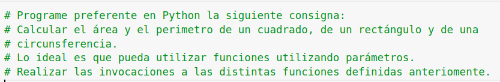
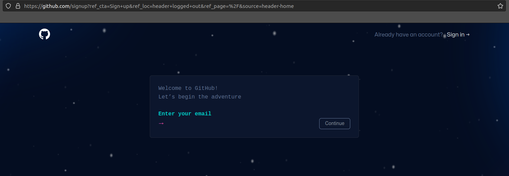

# UNAB - Programación Avanzada Cursada 2023

# Clase N. 1 - Introducción a la Programación orientada a Objetos
## Actividad 1 - Realizar la siguiente tarea (similar a la realizada en la Encuesta Inicial de la cursada)

 
 

## Actividad 2 - Crear una cuenta en GitHub

### Siguiendo las instrucciones https://github.com puede crear su cuenta personal:

 
 

## Actividad 3 - Crear un proyecto en GitHub y subir el archivo generado en la Actividad 1. Debe definir un nombre de proyecto.

### Realizar las acciones necesarias para publicar el archivo generado en la Actividad 1
 
 

## Actividad 4 - Invitar a un compañero de cursada a su proyecto en GitHub.

### Cursar invitación a un compañero de cursada a su proyecto en GitHub. Recibir módificaciones en su código fuente.
### Compartir la experiencia en Clase con el resto de sus compañeros.

